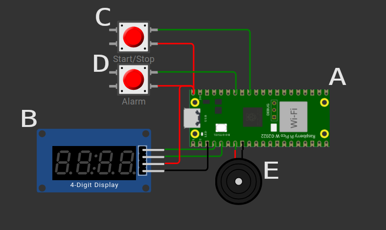

# StopWatch

Stopwatch is a simple device that acts like a timer with optional alarm feature.

## Usage

Parts:
- A - Raspberry Pico
- B - Display
- C - Start/Stop button. Use it to start counting or reset the counter.
- D - Alarm is used to set the time (in minutes) when the countdown will stop and buzzer will start buzzing. Optional.
- E - Buzzer, used to play sounds.
